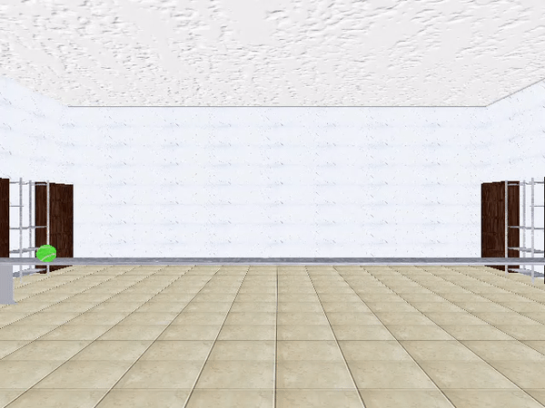

# 3D Motion Perception

  

   
  

  

  Previous studies have shown that the angle of approach is consistently overestimated for approaching (but passing-by) objects. An explanation based on a slow-motion prior has been proposed in the past to account for this bias. This mechanism relies on the in-depth component of the motion (less reliable) being more attracted towards the slow motion prior than the lateral component (more reliable). This hypothesis predicts that faster speeds in depth will translate into a greater bias if the perception of velocity in depth follows Weber’s law.
   
   
  You can find my very first paper about this topic [here](https://www.sciencedirect.com/science/article/pii/S0042698919300756).
  

---

# Optic Flow

  

   
  

  

  So far, the study of the optic flow has been dominated by the ecological perspective. This current of thought postulates that although a problem can be specified in infinite ways, when certain parameters remain stable (e.g. fixed size), the amount of possible solutions to the same problem is reduced for a few mathematically formalized solutions.
   
   
  A paradigmatic example is the Tau model ($\tau$), which directly specifies the remaining time to contact as the ratio between size and expansion rate. However, an increasing body of research has shown that interceptive behaviour do not match with Tau's predictions.
   
   
  In our project we aim to provide grounds for a 3D model in which known size and gravity can calibrate the optic flow to guide sensori-motor decisions. 
   
   
  Since it is the subject of my doctoral thesis, it is the main active project of my career under the supervision of [Joan López-Moliner](http://www.ub.edu/viscagroup/joan/)
  
  

---

# Air Drag representation

  

   
  

  

  When we make a prediction about the future state of an object, we not only take into account its physical properties (weight, size, speed, shape or texture), we also use the properties of the environment in which the action occurs (gravitational acceleration or lighting direction).
   
   
  At the present time we know that the human relies on a strong gravity prior to estimate an object's motion. However, the dynamic effect of air drag is an unexplored area. To our knowledge, there is a gap in the literature about whether the human being uses a representation of air resistance to make predictions about the position, contact time or instead uses instantaneous speed to perform such predictions. 
   
   
  To find out if this physical variable is taken into account, [Björn Jorges](https://b-jorges.github.io/rmarkdown-website-tutorial/index.html) , our supervisor [Joan López-Moliner](http://www.ub.edu/viscagroup/joan/) and I are preparing a set of experiments. 
  
  

---

