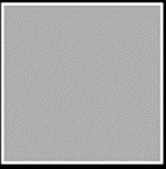
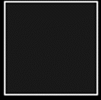
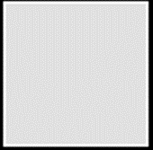
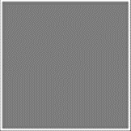
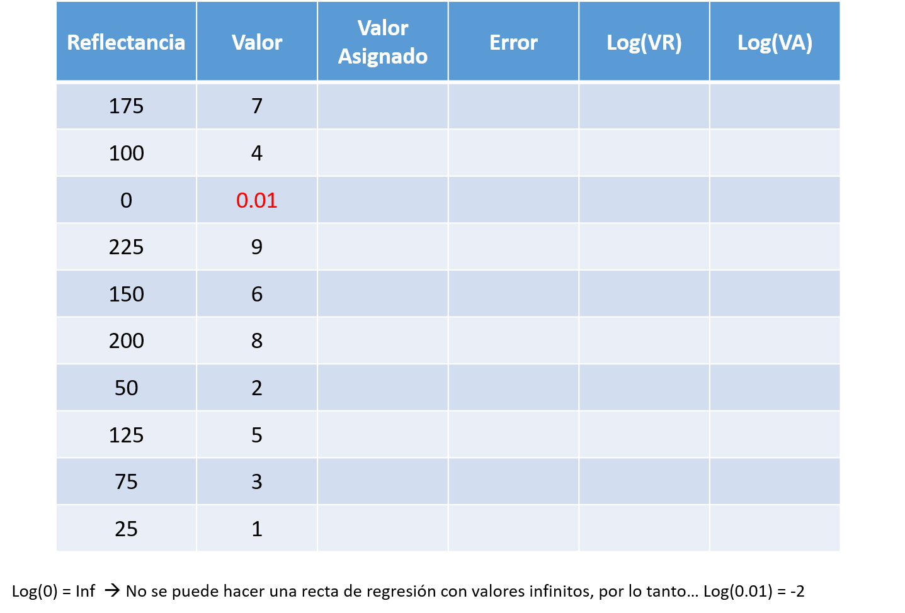

## {data-background=#808080}

## {data-background=#000000}

## {data-background=#000000}

## {data-background=#000000}

## {data-background=#000000}

## {data-background=#000000}

## {data-background=#000000}

## {data-background=#000000}

## {data-background=#000000}

## {data-background=#000000}

## {data-background=#000000}

## {}

## {.smaller}

- ¿Cuál es la forma de la correspondencia psicofísica que describe la ley de Fechner? ¿y la de Stevens? 

- ¿Qué método de estudio utiliza la psicofísica de Stevens?

- ¿Con qué objetivo aparece la ley de Stevens?

- ¿Por qué cada tipo de estimulación describe una curva diferente? 

- ¿Qué elemento en la ley de Stevens indica la forma de la relación entre estímulo y sensación?

- ¿Qué diferencia hay entre brillo y reflectancia?

- ¿Qué fotoreceptores son los principales encargados del procesamiento de la luminancia?

- ¿Qué tipo de curva de respuesta encajaría mejor con la respuesta a la luminancia?

- ¿Cómo sería su exponente en la ley de Stevens?

