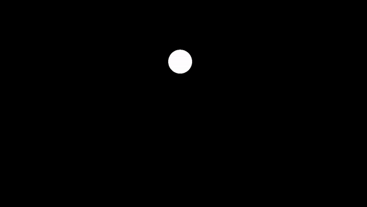
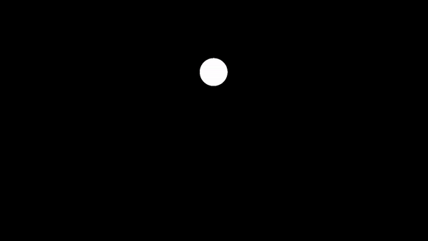

Puedes correr las demostraciones de los siguientes experimentos utilizando [PsychoPy](https://www.psychopy.org/download.html), o si lo prefieres, instalando [Python 3.7](https://www.python.org/downloads/) + el módulo de PsychoPy.

# Demos: active vision

<figure>

 
<figcaption>Elicits pursuit movements</figcaption>
</figure>

<figure>

 
<figcaption>Elicits pursuit (right) + saccadic (left) movements</figcaption>
</figure>

<figure>

 
<figcaption>Elicits mostly saccadic movements</figcaption>
</figure>

Puedes encontrar el código para éstas demos [aquí](./demos/circle.py)

# Demo: 3D motion perception

## Umbral Absoluto

<figure>
<video width="600px"controls>
  <source src="demos/3D_Motion_UA.mp4" type="video/mp4">
</video>
<figcaption>Cálculo del Umbral Absoluto en profundidad:
 Orden de los estímulos:
 1 : 0.45
 2 : 0.0
 3 : 0.3
 4 : 0.75
 5 : 0.6
 6 : 0.15
 7 : 0.9
</figcaption>
</figure>

Puedes encontrar el código para ésta demo [aquí](./demos/3D_Motion_UA.zip)

## Umbral diferencial

<figure>
<video width="600px"controls>
  <source src="demos/3D_Motion_UD.mp4" type="video/mp4">
</video>
<figcaption>Cálculo del Umbral Diferencial (Velocidad de referencia 1.5 m/s):
 Orden de los estímulos:
 1 : 2.1
 2 : 0.6
 3 : 1.2
 4 : 1.5
 5 : 0.9
 6 : 2.4
 7 : 1.8
</figcaption>
</figure>

Puedes encontrar el código para ésta demo [aquí](./demos/3D_Motion_UD.zip)

## Estimación de Luminancia

Para ver la presentación sobre estimación de la luminancia utilizando los métodos directos de Stevens pincha [aquí](./P3_files/Luminance_Estimation.html)

---
